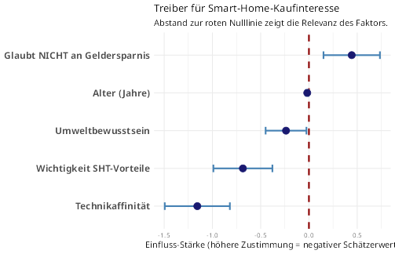
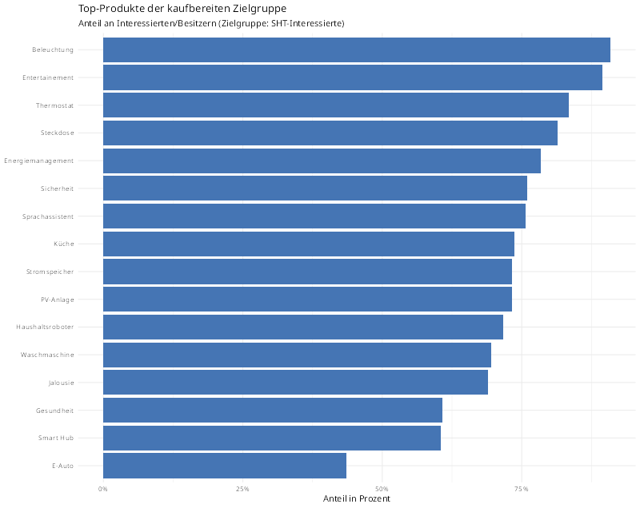
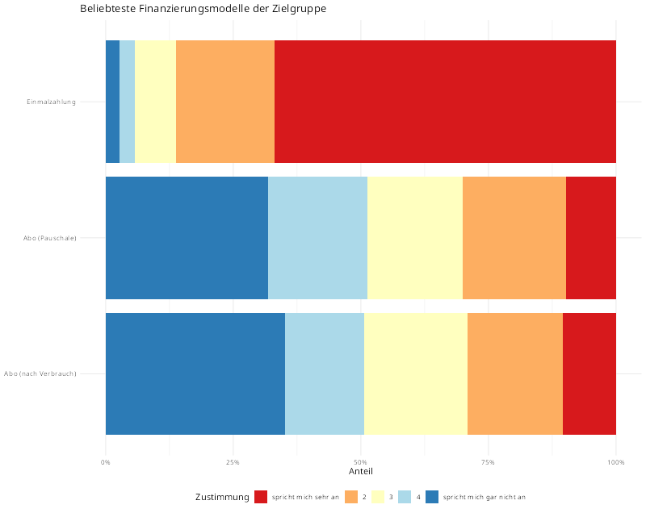
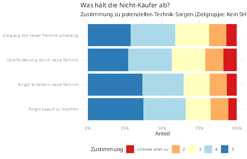

# Business Insights & Management Summary (Marketing)

Dieser Bericht übersetzt die deskriptiven Erkenntnisse der Smart Home (SHT) Umfrage in konkrete Handlungs- und Strategieempfehlungen für das Marketing. Mithilfe von Streuungsanalysen (MAD) und logistischer Regression wurden die entscheidenden Treiber für das Kaufinteresse ermittelt.

---

## 1. Was treibt das Kaufinteresse an?

Um Werbung effektiv zu platzieren, müssen wir wissen, welche Faktoren die Wahrscheinlichkeit eines Kaufs signifikant steigern. Das logistische Regressionsmodell zeigt ein klares Bild:

**Kernaussagen:**
*   **Der stärkste Hebel:** Eine hohe *Technikaffinität* und das generelle Verlangen nach den *Vorteilen eines Smart Homes* treiben das Kaufinteresse massiv.

*   **Die Illusion der Ersparnis:** Personen, die SHT kaufen wollen, tun dies *nicht* aus der primären Motivation, Geld zu sparen. Werbung, die reine Kosteneinsparung verspricht, verfehlt die Kern-Zielgruppe.

*   **Demographie:** Das Einkommen und Geschlecht spielen keine signifikante Rolle für das prinzipielle Kaufinteresse. Jedoch ist eine leichte Tendenz zu *jüngeren Kunden* erkennbar.

---

## 2. Welche Produkte will die "heiße" Zielgruppe?

Bei Fokussierung auf das isolierte Segment der "kaufbereiten" Kunden zeigt sich, welche Produktkategorien derzeit die höchste Relevanz haben:

---

## 3. Wie wollen die Kunden bezahlen?

Die Auswertung der bevorzugten Finanzierungsmodelle innerhalb der interessierten Zielgruppe gibt wichtige Hinweise für das Pricing:

**Kernaussagen:**

*   Die klassische **Einmalzahlung** wird weiterhin deutlich bevorzugt.

*   Abomodelle (verbrauchs- oder pauschalabhängig) stoßen selbst bei der "heißen" Zielgruppe auf große Skepsis und Ablehnung. Für erfolgreiche "As as Service"-Modelle im SHT-Bereich muss eine extrem hohe, spürbare Wertschöpfung für den Kunden geschaffen werden.

---

## 4. Was blockiert die "Nein-Sager"?

Um den adressierbaren Markt zu vergrößern, lohnt ein Blick auf jene 68% der Befragten, die derzeit kein Interesse an SHT haben. Welche Hürden müssen abgebaut werden?

**Kernaussagen:**
*   Die größten Blockaden liegen in der Angst vor **Datenverlust**, **Ausfall der Technik** und der Sorge, das System nicht kontrollieren zu können.

*   Marketing-Kampagnen zur Markterweiterung müssen sich primär auf Datenschutz ("Privacy by Design"), einfache Installation und hohe Ausfallsicherheit konzentrieren.

---

## 5. Strategische Ableitungen: Buyer Personas

Basierend auf den Modellen lassen sich zwei konkrete Zielgruppen-Profile für zukünftige Ad-Kampagnen formen:

### Persona A: Der "Smart Tech Enthusiast"
*   **Fokus:** Eher jünger, Einkommen spielt eine untergeordnete Rolle.
*   **Treiber:** Sehr hohe Technikaffinität; will neueste Systeme ausprobieren; sucht Komfort, Automatisierung und "Spielereien".
*   **Marketing-Ansatz:** Highlight-Fokus auf Features, breite Ecosystem-Integration (z.B. Google/Apple Home) und den "Coolness-Faktor". Werbung mit ROI und Cent-Beträgen zündet bei ihm nicht.

### Persona B: Der "Eco-Manager"
*   **Fokus:** Heterogen im Alter, aber stark klima- und umweltbewusst.
*   **Treiber:** Sucht explizit nach smarten Tools (wie PV-Anlagen oder Smart-Heating), um den eigenen CO2-Fußabdruck zu senken und die Kontrolle über den Verbrauch zu haben.
*   **Marketing-Ansatz:** Fokus auf Transparenz des Energieverbrauchs, nachhaltige Hardware und das gute Gefühl, aktiv etwas für den Klimaschutz zu tun. Komplizierte Schnittstellen müssen vermieden werden.

