``` yaml
title: Explorative Datenanalyse
subject: Erweiterte Methoden der Statistik
author: Michael de Lorenzo, Stefan Ebner, Thomas Proksch, Victoria Uller
affiliation: FH Campus02
year: WS25
```

Vorschlag fuer weiterere EDA (Idee!):

Wir sind die Firma shtR's und verkaufen IoT. Marketing Abteilung hat Umfrage gemacht und will fuer strategisches Marketing wissen, fuer welche Kunden sie werben sollen oder wie? Interessen etc.

[] Genaue Korrelation von stark korrelierenden Themen

[] MAD - Median absolute deviation. Um zu sehen ob die Median Korrelationen ueberhaupt Sinn machen

[] Wie/Wo Kundengewinnen

[] Ads etc

[] Logistische Regression fuer Kundengewinnung? Wie W! dass jemand SHT kaufen wuerden fuer Ads oder so?


# Einleitung

Bei den Daten handelt es sich um eine Umfrage zu dem Thema Smart Home Technologies (SHT).
Der Datensatz besteht aus **960 Zeilen** (Teilnehmer) und **283 Spalten** (Fragen). Wobei von den Merkmalen nur ein Bruchteil bekannt ist.

---

# Data cleaning

Die Ausprägungen werden den entsprechenden Datentypen zugewiesen. Das sind hauptsächlich ordinale Daten (Likert-Skala).

---

# überblick

Um einen Eindruck des Datensatzes zu gewinnen, wurden alle Fragenblöcke visualisiert.

---

## Demographische Daten

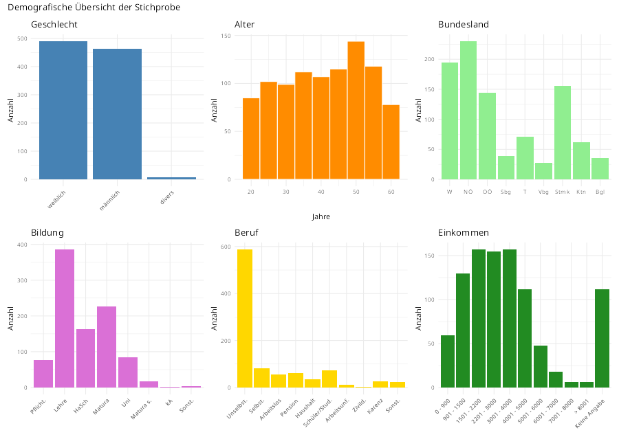

---

## Hauptfragen

Wie bei den demographischen Daten wurden die Blöcke der Hauptfragen für eine Übersicht visualisiert.

---

### Wichtigkeit der Vorteile durch Nutzung SHT

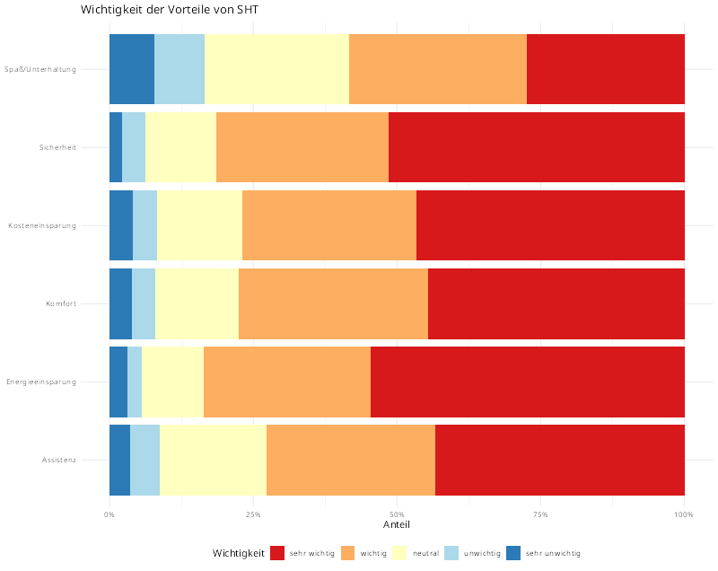

Sehr ausgegeglichenes Bild. Spannenderweise ist der Unterhaltungsfaktor am unwichtigsten.

---

### Verfügbarkeit und Interesse an SHT

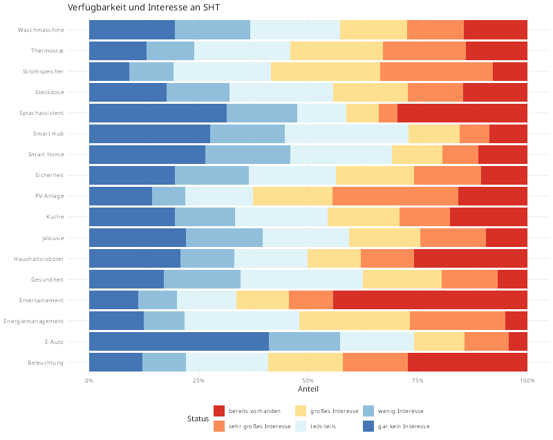

Bei der Frage nach Vorteilen durch Nutzung SHT war Unterhaltung am wenigsten wichtig, hier zeigt sich, dass die meisten Befragten bereits SHT im Bereich Unterhaltung besitzen.
E-Autos sind unter den Teilnehmer total uninteressant.

---

### Komfortgewinn durch Nutzung SHT

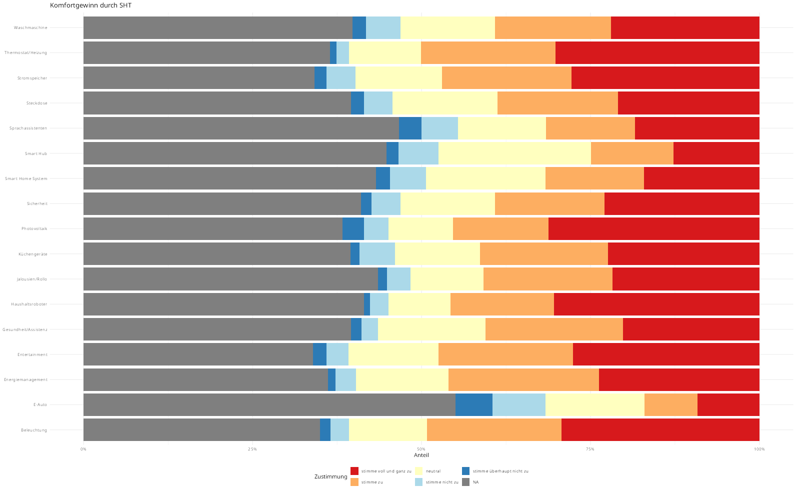

Die meisten Teilnehmer sehen einen Komfortgewinn durch die Nuztung von SHT, abgesehen vom E-Auto.

---

### Assistenz durch SHT

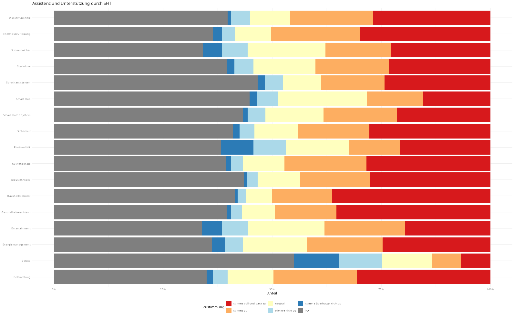

Frage ist durch sehr viele NA's geprägt.
Wir meinen, dass sich die Mehrheit der Befragten durch die Nutzung von SHT unterstützt fühlen.

---

### Auswirkung der Nutzung von SHT auf Energieeinsparung

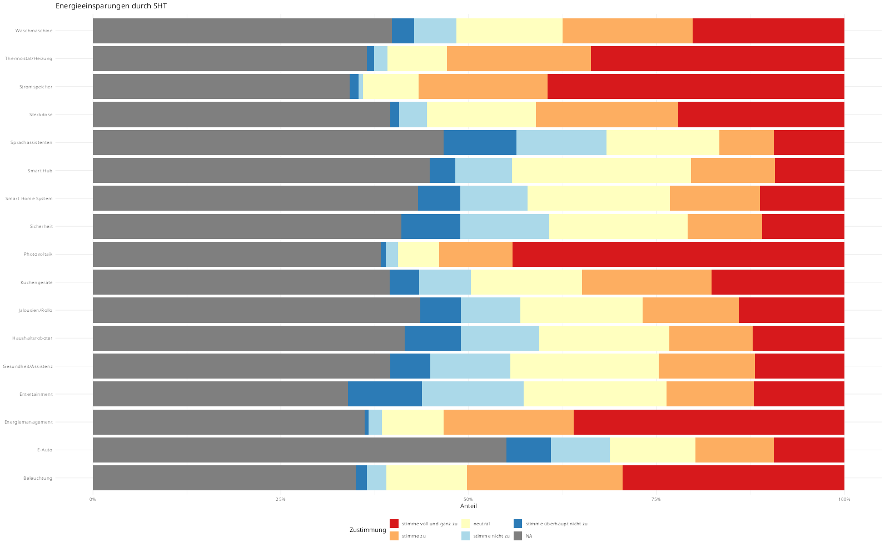

Auch bei diesen Fragen sehr viele NA's. Dennoch zeigt das Bild, dass die meisten Teilnehmer vor allem in den Punkten Strom und Energie durch die Nutzung von SHT sparen können.

---

### Auswirkung auf Sicherheit durch Nutzung SHT

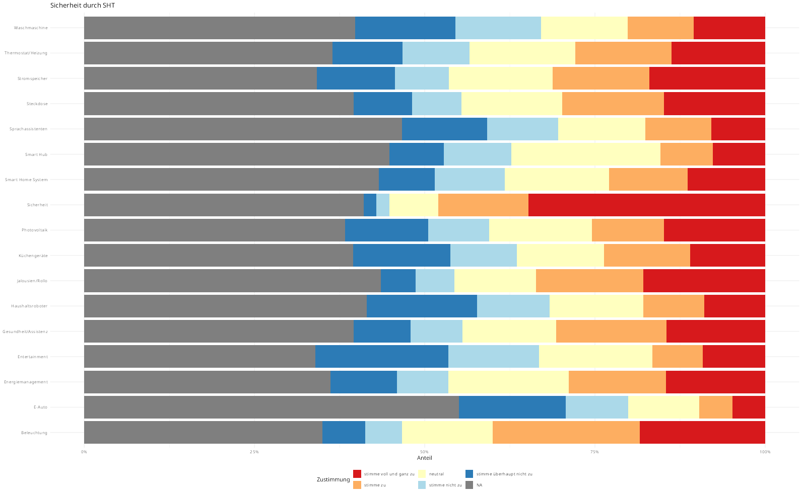

Die Teilnehmer sind der Meinung, dass sich die Nutzung von SHT nicht positiv auf die Sicherheit auswirkt.

---

### Auswirkung auf Spaß und Unterhaltung durch Nutzung SHT

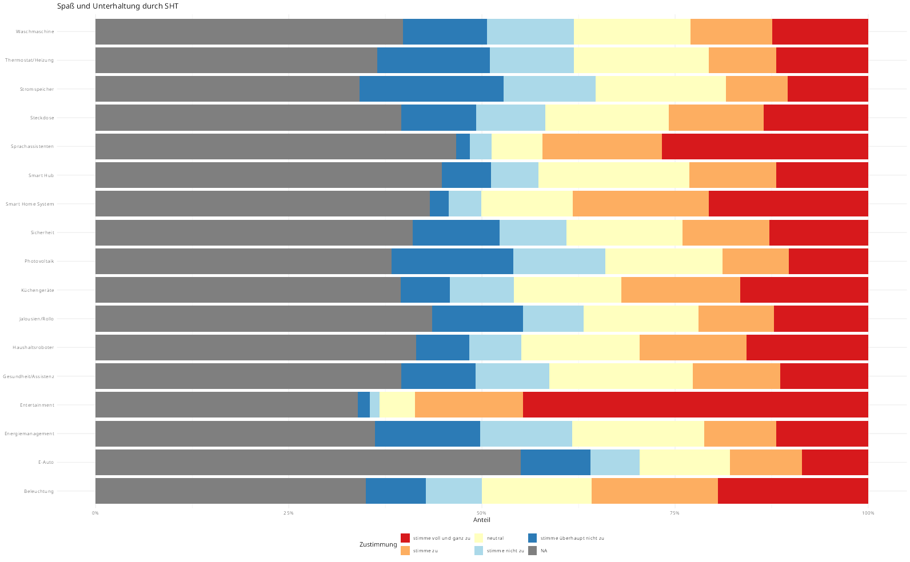

Die Frage ist etwas seltsam, da wir nicht nachvollziehen können inwiefern sich SHT auf den Unterhaltungsfaktor einer PV-Anlage auswirken soll.

~40% der Teilnehmer stimmen allerdings zu, dass sich SHT  im Bereich Unterhaltung, auf den Spaß- und Unterhaltungsfaktor auswirkt.

---

### Auswirkung auf Kosteneinsparung durch Nutzung SHT

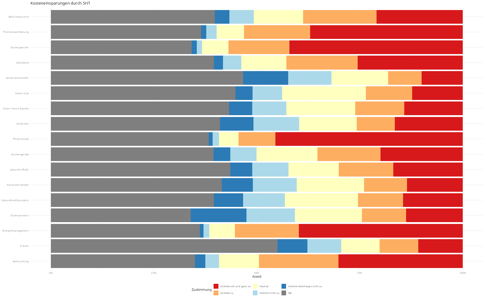

Viele Teilnehmer stimmen zu, dass sie, vor allem in Bereich Strom und Energie, Kosten durch die Nutzung von SHT sparen können.

---

### Meinungen zu SHT

Der folgende Fragenblock wurde in zwei Bereiche unterteilt, da man diese bereits durch die unterschiedlichen Fragestellungen gut trennen kann.

- Technikaffinität
- Energiesparmaßnahmen

#### Technikaffinität

[Technikaffinität](output/plots/meinung-technikaffinitaet.png)

Der Großteil der Befragten würde sich als Technikaffin beschreiben und hat wenig Angst vor neuer Technik.

#### Energiesparmaßnahmen

[Energiesparmaßnahmen](output/plots/meinung-energiesparen.png)

Die Teilnehmer zu, dass herkömmliche Maßnahmen (Stoßlüften, etc.), um Energie zu sparen, wirksam sind.

---

### Steuerung SHT

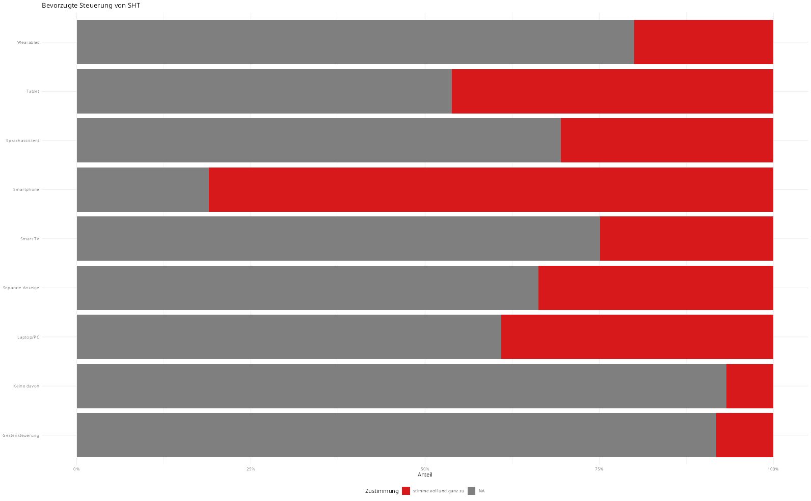

Eine Steuerung durch Smartphone ist die klar präferierte Lösung.

---

### Finanzierung SHT

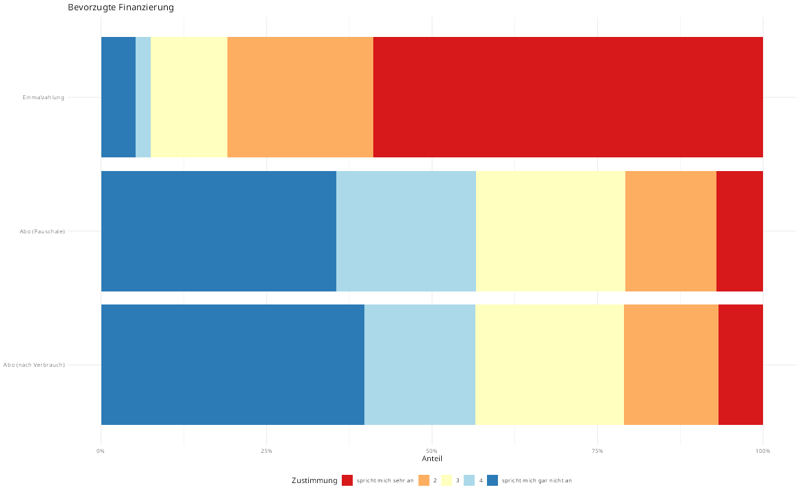

---

### Informationsgewinn SHT

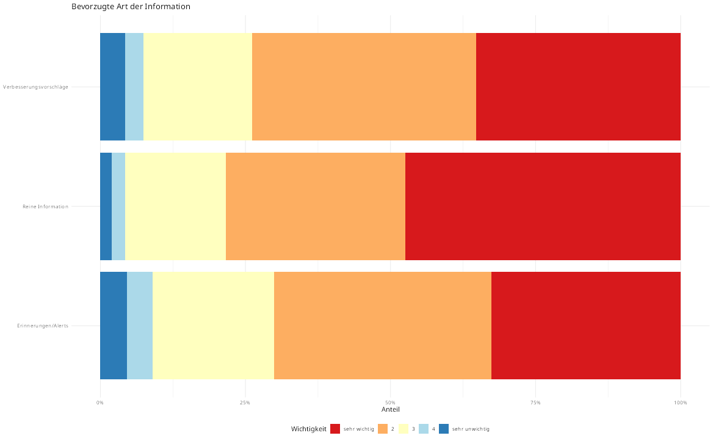

---

### Design SHT

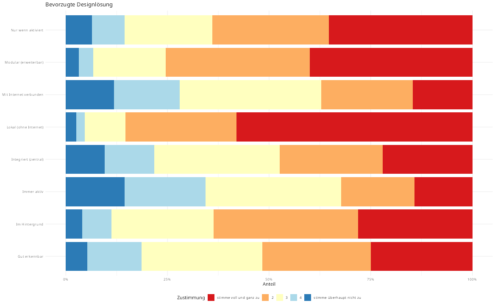

---

### Steuerung SHT

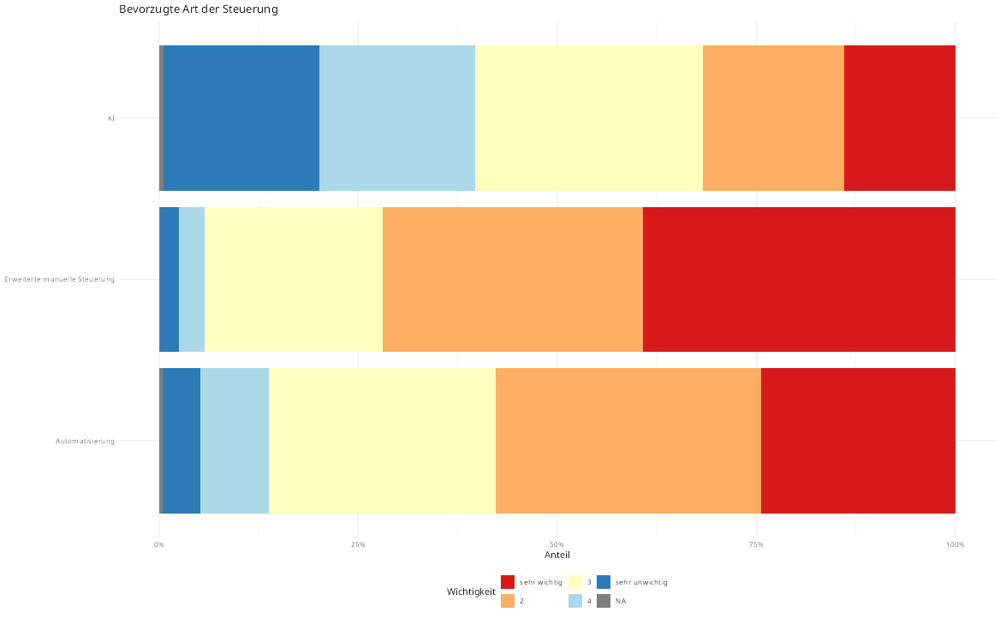

---

### Nachhaltigkeit SHT

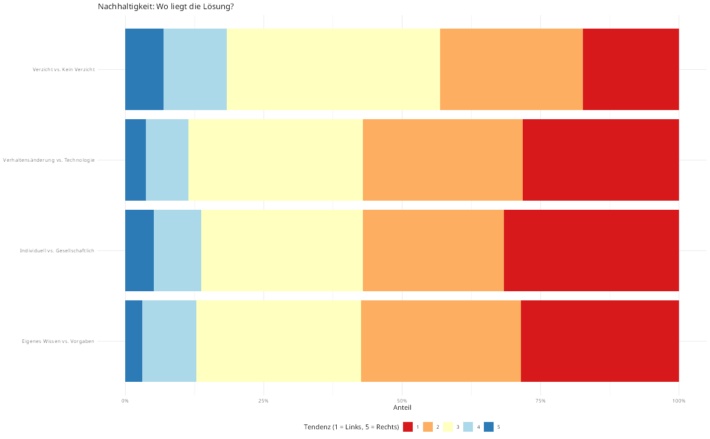

---

### Klima- & Umweltbewusstsein SHT

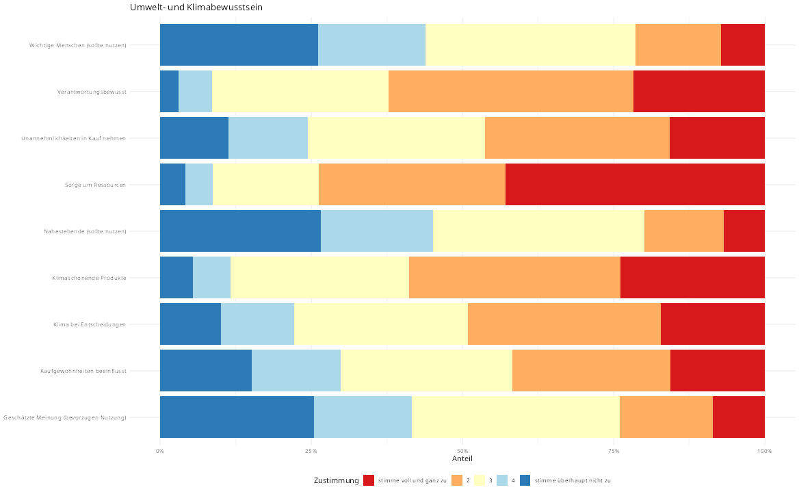

---

## Korrelation unter Hauptfragen

In jeder Hauptfrage wurde der Median der Antworten der Befragten gebildet und untereinander verglichen. In weiterer Folge sollen die einzelnen Fragen der stark korrelierenden Hauptthemen analysiert werden.

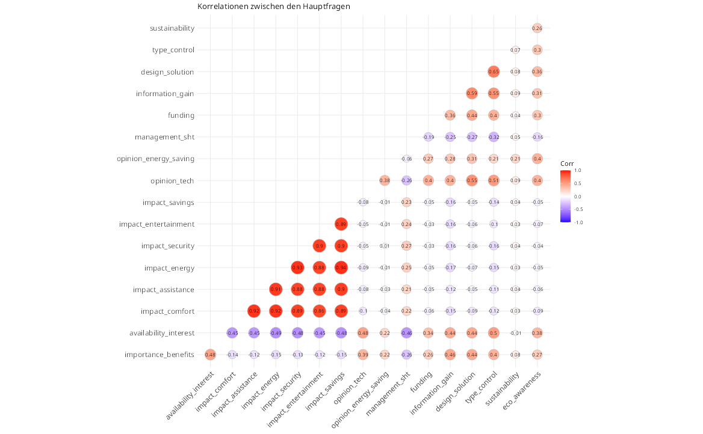

---


